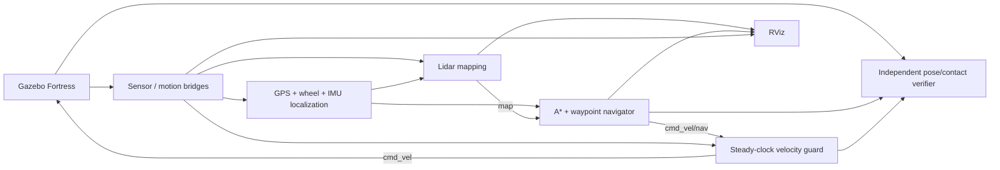

# Design notes and discussion guide

## What the demonstration proves

The supplied robots consume actual simulator sensors, build a map from lidar rays, reach a geographic target through a custom planner/controller, and are checked by an independent Gazebo truth/contact monitor. The implementation favors a small, inspectable ROS 2 system whose behavior can be explained and reproduced. It does not establish hardware readiness or robust navigation in arbitrary unknown/dynamic environments.



The verifier cannot influence the controller. Asset generation writes `verification.json` with geometry/start and a separate `mission.json` without either. Control subscriptions never consume `/world/navigation/dynamic_pose/info` or `/contacts/*`.

## Why these components

**Humble + Fortress:** both choices are allowed by the assignment. ROS Humble targets Ubuntu 22.04; Fortress provides native GPU lidar, RGB-D, NavSat, IMU and differential/skid drive. A Classic ROS GPS plugin cannot run inside the Ignition plugin ABI. The bridge maps native NavSat output to the same ROS `NavSatFix` sensor contract.

**Custom A* instead of Nav2:** Nav2 is optional here. This implementation makes grid inflation, corner rules, visibility pruning, replanning, waypoint following and stopping behavior directly reviewable. The tradeoff is fewer established recovery/local-planner features. A production extension could feed this mapper/localizer into Nav2, replacing route following with a mature local controller and behavior tree; it would still need suitable localization and costmap settings.

**Mapping rather than full SLAM:** GPS anchors position and the ideal simulated IMU anchors heading. Scan rays can therefore be accumulated in a global occupancy map without scan matching or loop closure. This meets map construction, while avoiding a false claim of SLAM. Real GPS/IMU inaccuracies would smear obstacles; hardware would need tuned fusion, scan matching and/or a proper SLAM/localization system.

**Footprint circle:** it encloses body, wheels and payload in XY and remains valid during in-place turns. It is conservative compared with a rotated polygon but straightforward to inflate, check and independently measure. The preferred margin exceeds the small simulated stop distance. A bounded recovery can briefly reduce only the preferred margin, retaining the physical circle with conservative cell padding.

**Optimistic unknown cells:** otherwise an unseen goal would have no path before exploration. The robot plans through unknown areas at low speed and changes its route when lidar exposes obstacles. This is suitable for the selected static worlds with 360° range coverage. A safety-critical unknown environment would require explicit exploration/frontiers, stronger local collision checks and a validated stopping envelope.

**Separate guard:** controller failures and simulation clock stalls are different from planner failure. A steady timer keeps commanding zero after the navigator stops producing requests. It also monitors live sensors and clamps velocity. Its own failure is outside its protection; that motivates a motor-side watchdog on hardware.

The obstacle course uses one direct GPS target B. Warehouse and outdoor presets use a gold GPS guide point (-4.5, 1.5 m) before B; each visit is independently checked against simulator truth. Obstacles still require replanning on the final leg. These are documented mission presets using the assignment’s ordered-waypoint option.

## Coordinate frames and ownership

- `map`: local ENU, X east, Y north, Z up, referenced to the configured geodetic datum.
- `odom`: continuous wheel-integrated motion; it can drift/slip.
- `base_link`: shared body reference across presets; root is massless for robot-state-publisher/KDL, with inertial body on a fixed child. SDF conversion combines fixed bodies for physics.
- `lidar_link`, `gps_link`, `imu_link`, `camera_link`: physical payload frames.
- `camera_optical_link`: X right, Y down, Z forward, represented by a fixed URDF rotation.

`map → odom` is calculated as `T(map, base) × inverse(T(odom, base))`. The localizer is its sole publisher and adds a fixed nominal vertical body height for accurate model/sensor visualization above the floor. Vertical suspension motion is not estimated. Fortress DiffDrive owns `odom → base_link`; robot state publisher owns the model's joint transforms. Adding another publisher of the same edge would create conflicting TF.

The GPS antenna is centred in XY. The mapper rotates/translates each robot's lidar offset and selects the localized pose nearest the scan timestamp, rejecting >0.2 s mismatch. Camera safety uses distances in camera coordinates and adjusts its threshold for the forward offset.

## Algorithms to explain

**ENU projection:** WGS84 meridian and prime-vertical radii at the datum convert latitude/longitude increments into north/east metres. It is a tangent-plane approximation for the 14 m world, not a worldwide projection. GPS target conversion and GPS measurements use exactly the same datum. Altitude is not used for planar navigation.

**Position fusion:** wheel XY increments are rotated from the odometry heading into the latest filtered IMU heading. Position variance grows with predicted travel; a scalar Kalman gain blends each accepted GPS fix. Innovations >1.5 m are rejected. The implementation does not claim a full state EKF, sensor bias estimation, general 3D motion, or realistic GNSS covariance.

**Occupancy:** unknown = -1. Each scan adds -0.45 log odds to free-ray cells and +0.9 to endpoint cells, with hit cells taking priority within that scan. Bounds [-4, 4] prevent unbounded confidence. Probability is `1 / (1 + exp(-log_odds))`; >=0.65 is occupied for planning. Infinite/max-range measurements clear visible rays without inventing a hit; invalid ranges are ignored. Two-degree ray sampling and 0.08 m traversal samples are used on a 0.1 m grid.

**A*:** eight-connected movement has costs 1 and √2, with a Euclidean admissible heuristic. Both adjacent cardinal cells must be free for a diagonal. A segment sampler at one-third cell spacing checks route pruning against the inflated map. If the source is inside the preferred inflation but outside the hard physical envelope, nearby checked escape candidates can connect to a normal route. The active escape connector is retained until completed, so repeated map updates cannot move the escape target back and forth. Occupied goals or an unsafe source return no path.

**Controller:** angular command is heading error ×1.8, limited to ±0.7 rad/s. Translation is limited by preset speed, remaining vertex distance and heading cosine; it is disabled for >0.45 rad error. A 0.10 m vertex tolerance advances the route only when the next segment is free from the current pose; mission waypoint tolerance is 0.20 m. At most once per second, newly blocked remaining segments trigger replanning. Final success publishes zero continuously.

**Depth parsing:** support metre-valued float32 and millimetre-valued uint16, endianness and padded row stride. Use a central horizontal band to exclude the floor; ignore invalid/out-of-range pixels and take the fifth percentile. A far/empty valid view is permitted rather than treated as a wall.

## Evidence boundaries

The matrix runs actual Gazebo physics/sensors and observes contact messages from all collision-bearing robot links. Empty contact messages are not assumed to prove absence of collisions: the tests require a live contact stream (ground/wheel contacts). A zero obstacle count is paired with true geometric clearance and final pose error. The enclosing-circle clearance is conservative and does not claim exact polygon clearance.

`SUCCEEDED` alone is insufficient. The verifier checks actual goal position, observed sensor/truth/contact streams, final command and report freshness. Separate fault tests verify the guard's wall-time response. Pure tests inspect map initialization, ray clearing, planner geometry, GPS projection/correction and depth decoding. Docker supplies a separate clean dependency/build/runtime check.

Video footage is captured from actual Gazebo/RViz X11 windows; captions read the live report. The optional bag records real ROS messages. Any edited video timing or held frames is disclosed in its metadata. Validation applies to the archived configurations and runs, not to arbitrary worlds.

## Useful review commands

With ROS and `install/setup.bash` sourced, and the UDP profile/domain set consistently:

```bash
ros2 node list
ros2 node info /gps_localizer
ros2 node info /lidar_mapper
ros2 topic hz /scan
ros2 topic echo /gps/fix --once
ros2 run tf2_ros tf2_echo map base_link
ros2 topic echo /mission/verification
ros2 topic echo /safety/status
```

Be prepared to discuss what changes for noisy GPS, gyro-only heading, moving obstacles, a failed safety process, an occupied goal, different payload offsets, and a larger world. The honest answers are the documented limits and the specific extensions required, rather than a claim that the small demo already solves them.
