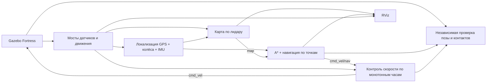

# Архитектура, алгоритмы и подготовка к обсуждению

**Язык / Language:** Русский · [English](DESIGN.md) · [Главная страница](README.ru.md)

## Что показывает демонстрация

Представленные роботы используют реальные потоки датчиков симулятора, строят карту по лучам лидара и достигают географической цели с помощью собственного планировщика/контроллера. Результат проверяет независимый монитор истинной позы и контактов Gazebo. Система ROS 2 достаточно компактна, чтобы её поведение можно было объяснить и воспроизвести. Демонстрация не подтверждает готовность к реальному оборудованию или устойчивую навигацию в произвольных неизвестных/динамических окружениях.



Проверяющий узел не влияет на контроллер. Генератор создаёт `verification.json` с геометрией/стартом и отдельный `mission.json` без этих данных. Узлы управления не подписываются на `/world/navigation/dynamic_pose/info` или `/contacts/*`.

## Почему выбраны эти компоненты

**Humble + Fortress:** оба варианта разрешены заданием. ROS Humble рассчитан на Ubuntu 22.04; Fortress предоставляет нативные GPU-лидар, RGB-D, NavSat, IMU и дифференциальный привод, включая поворот с проскальзыванием. Плагин GPS для Classic нельзя загрузить через ABI плагинов Ignition. Мост преобразует нативные данные NavSat в ROS-сообщение `NavSatFix`.

**Собственный A* вместо Nav2:** Nav2 не обязателен. Здесь непосредственно видны расширение препятствий, правила прохождения углов, сокращение пути по видимости, перепланирование, движение по точкам и остановка. Обратная сторона — меньше готовых функций восстановления и локального планирования. При дальнейшем развитии можно подключить эту карту/локализацию к Nav2 и заменить следование маршруту зрелым локальным контроллером и деревом поведения; настройки локализации и карты стоимости всё равно потребуются.

**Построение карты вместо полного SLAM:** GPS задаёт положение, идеальный IMU симулятора — направление. Поэтому лучи сканов накапливаются в глобальной карте без сопоставления сканов и замыкания петель. Это выполняет требование построения карты. Неточности реальных GPS/IMU размывали бы препятствия; для оборудования нужны настроенное объединение датчиков, сопоставление сканов и/или полноценная система SLAM/локализации.

**Окружность габаритов:** охватывает корпус, колёса и датчики в XY и остаётся корректной при повороте на месте. Она консервативнее повёрнутого многоугольника, но проста для расширения препятствий, проверки и независимого измерения. Предпочтительный запас превышает небольшой тормозной путь в симуляции. Ограниченный выход из зоны уменьшенного запаса временно сокращает только предпочтительный запас, сохраняя физическую окружность с консервативной поправкой на клетку.

**Проходимость неизвестных клеток:** без этого путь к невидимой цели отсутствовал бы до исследования окружения. Робот планирует через неизвестные области на низкой скорости и меняет путь, когда лидар обнаруживает препятствия. Это подходит выбранным статическим мирам с обзором 360°. Для неизвестной среды с высокими требованиями к безопасности потребуются явное исследование границ известной карты, более строгие локальные проверки столкновений и подтверждённая зона остановки.

**Отдельный контроль скорости:** отказ контроллера и остановка часов симуляции отличаются от отказа планировщика. Монотонный таймер продолжает выдавать нулевые команды после прекращения запросов навигатора. Узел также проверяет текущие данные датчиков и ограничивает скорости. Его собственный отказ не покрывается; на оборудовании нужен сторожевой таймер на стороне двигателя.

Полоса препятствий использует одну непосредственную GPS-цель B. Склад и открытая площадка сначала посещают отмеченную золотым GPS-точку (-4.5, 1.5 м), затем B. Каждое посещение независимо проверяется по истинной позе симулятора. На последнем участке препятствия всё равно требуют перепланирования. Это явно описанные миссии, использующие разрешённый заданием список waypoints.

## Системы координат и владельцы TF

- `map`: локальная ENU, X на восток, Y на север, Z вверх; привязана к заданному геодезическому началу.
- `odom`: непрерывная колёсная одометрия; возможны дрейф и проскальзывание.
- `base_link`: общая система корпуса; корневое звено не имеет массы для robot-state-publisher/KDL, инерция корпуса находится в фиксированном дочернем звене. При преобразовании в SDF фиксированные тела объединяются для физики.
- `lidar_link`, `gps_link`, `imu_link`, `camera_link`: физические системы датчиков.
- `camera_optical_link`: X вправо, Y вниз, Z вперёд; задана фиксированным поворотом URDF.

`map → odom` вычисляется как `T(map, base) × inverse(T(odom, base))`. Локализатор — его единственный издатель. Он добавляет постоянную номинальную высоту корпуса, чтобы модель и датчики правильно отображались над поверхностью. Вертикальные движения подвески не оцениваются. Fortress DiffDrive публикует `odom → base_link`, robot state publisher — преобразования суставов модели. Второй издатель того же ребра создавал бы конфликт TF.

GPS-антенна расположена по центру в XY. Узел карты поворачивает/переносит смещение лидара выбранного робота и выбирает ближайшую к скану локализованную позу; расхождение по времени > 0.2 с отклоняется. Проверка камеры использует расстояния в системе камеры и корректирует порог по её смещению вперёд.

## Алгоритмы для объяснения

**Проекция ENU:** радиусы меридиана и первого вертикала WGS84 в геодезическом начале преобразуют приращения широты/долготы в метры по северу/востоку. Это приближение касательной плоскостью для мира размером 14 м, а не глобальная проекция. GPS-цели и измерения GPS используют одно геодезическое начало. Высота не участвует в плоской навигации.

**Объединение положения:** приращения колёсной одометрии XY поворачиваются из направления одометрии в последнее отфильтрованное направление IMU. Дисперсия положения растёт с предсказанным перемещением; скалярный коэффициент Калмана добавляет каждое принятое GPS-измерение. Невязки > 1.5 м отклоняются. Это не полный EKF состояния, оценка смещения датчиков, общая 3D-модель или реалистичная модель ковариаций GNSS.

**Занятость:** неизвестная клетка = -1. Скан добавляет -0.45 к логарифмическому отношению шансов свободных клеток луча и +0.9 к клеткам конечных точек; в пределах скана попадание имеет приоритет. Ограничение [-4, 4] предотвращает неограниченную уверенность. Вероятность `1 / (1 + exp(-log_odds))`; значения >= 0.65 считаются занятыми при планировании. Бесконечные/максимальные дальности очищают видимые лучи без вымышленного попадания; некорректные дальности игнорируются. Лучи выбираются через два градуса, шаг обхода луча — 0.08 м при сетке 0.1 м.

**A*:** восемь направлений имеют стоимости 1 и √2, эвристика — допустимое евклидово расстояние. Для диагонали обе соседние клетки по основным осям должны быть свободны. Проверка сегмента с шагом в треть клетки контролирует сокращение пути на расширенной карте. Если начало находится внутри предпочтительного расширения, но вне жёстких физических габаритов, проверенные ближайшие кандидаты выхода могут соединить его с обычным маршрутом. Активный сегмент выхода сохраняется до завершения, чтобы обновления карты не перемещали его цель туда-сюда. Занятая цель или небезопасное начало приводят к отсутствию пути.

**Контроллер:** угловая команда — ошибка направления × 1.8, с ограничением ±0.7 рад/с. Линейная скорость ограничивается скоростью модели, оставшимся расстоянием до вершины и косинусом ошибки направления; при ошибке > 0.45 рад движение отключено. Допуск вершины 0.10 м позволяет перейти к следующей только при свободном сегменте от текущей позы; допуск точки миссии — 0.20 м. Не чаще раза в секунду новые блокировки оставшихся сегментов вызывают перепланирование. После завершения постоянно публикуется нулевая скорость.

**Разбор глубины:** поддерживаются float32 в метрах и uint16 в миллиметрах, порядок байтов и шаг строки с заполнением. Центральная горизонтальная полоса исключает пол; недопустимые пиксели и значения вне диапазона игнорируются, выбирается пятый процентиль. Корректный вид без близких объектов допускается и не трактуется как стена.

## Границы доказательств

Матрица запускает реальную физику/датчики Gazebo и наблюдает сообщения контактов всех звеньев робота с геометрией столкновений. Пустые сообщения сами по себе не доказывают отсутствие столкновений: проверки требуют живого потока контактов, включая контакт колёс с землёй. Нулевое число касаний препятствий сопровождается истинным геометрическим зазором и ошибкой конечной позы. Зазор по охватывающей окружности консервативен и не равен точному зазору многоугольника корпуса.

Одного `SUCCEEDED` недостаточно. Проверяются фактическое положение цели, наблюдаемые потоки датчиков/истинной позы/контактов, конечная команда и актуальность отчёта. Отдельные испытания отказов проверяют реакцию контроля скорости по реальному времени. Чистые тесты проверяют начальное состояние карты, очистку лучами, геометрию планировщика, проекцию/коррекцию GPS и разбор глубины. Docker отдельно проверяет зависимости, сборку и выполнение в чистом окружении.

Видео записывается из реальных окон Gazebo/RViz через X11; подписи читают текущий отчёт. Необязательный bag содержит реальные сообщения ROS. Изменение времени воспроизведения или удержание кадров раскрывается в метаданных. Проверка относится к сохранённым конфигурациям и запускам, а не к произвольным мирам.

## Команды для проверки

Подключите ROS и `install/setup.bash`; задайте одинаковые UDP-профиль и ROS domain:

```bash
ros2 node list
ros2 node info /gps_localizer
ros2 node info /lidar_mapper
ros2 topic hz /scan
ros2 topic echo /gps/fix --once
ros2 run tf2_ros tf2_echo map base_link
ros2 topic echo /mission/verification
ros2 topic echo /safety/status
```

Подготовьтесь обсудить изменения при шумном GPS, направлении только по гироскопу, движущихся препятствиях, отказе узла безопасности, занятой цели, других смещениях датчиков и увеличении мира. Объяснение должно опираться на описанные ограничения и необходимые расширения системы.
