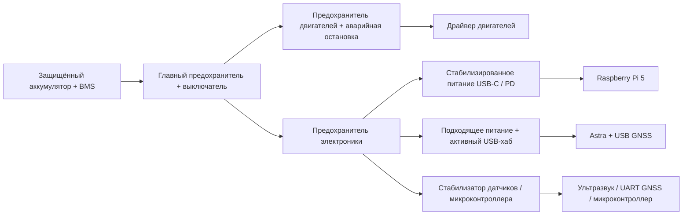

# Подключение датчиков и питание на Raspberry Pi 5

**Язык / Language:** Русский · [English](ELECTRONICS.md) · [Главная страница](README.ru.md)

Ответы описывают практический подход к интеграции. Точные напряжение питания, ток, распиновку и поддержку программного обеспечения следует проверить для выбранных моделей Astra и GNSS-приёмника.

## 1 Подключение датчиков

**Orbbec Astra:** подключение через USB. Разъём CSI Raspberry Pi для этой камеры не используется. Проверьте точную модель Astra, наличие совместимого с ARM64 SDK Orbbec/OpenNI, режим USB и доступную мощность питания. Если камера потребляет большой ток, используйте USB-хаб с отдельным питанием; он не должен подавать питание обратно в Pi. В [спецификациях Astra производителя](https://www.orbbec.com/products/structured-light-camera/astra-series/) указаны интерфейсы и рабочие диапазоны конкретных вариантов.

**Ультразвуковые дальномеры:** для устройства типа HC-SR04 используйте выход GPIO для Trigger и вход GPIO для Echo. Сигнал Echo 5 В должен пройти через подходящий преобразователь уровней или резистивный делитель до входа Pi 3.3 В. Проверьте, соответствует ли Trigger 3.3 В порогу выбранного модуля; при необходимости преобразуйте и его уровень. Нужна общая сигнальная земля. Несколько датчиков запускайте последовательно, чтобы избежать акустических помех друг другу. Для надёжного измерения длительности импульса можно использовать небольшой микроконтроллер и передавать дальности в Pi по USB serial, UART или I²C: временные измерения в пользовательском пространстве Linux менее детерминированы. Другой вариант — дальномер с нативным интерфейсом I²C/UART 3.3 В.

**GPS/GNSS:** выберите USB-приёмник либо приёмник с документированным UART 3.3 В, соединив TX с RX и сигнальную землю. Включите нужный UART Pi, отключите конфликтующую консоль входа по последовательному порту и проверьте имя устройства на Pi 5. Допустимое напряжение питания модуля не определяет логические уровни его UART. При необходимости точной синхронизации подайте PPS на совместимый GPIO; подключите подходящую антенну.

[Документация оборудования Raspberry Pi](https://www.raspberrypi.com/documentation/computers/raspberry-pi.html#gpio) описывает интерфейсы и логические уровни GPIO. Нельзя напрямую подавать сигнал 5 В на вход GPIO 3.3 В.

## 2 Питание системы от одного аккумулятора

Используйте защищённый аккумулятор, подходящий двигателям, с правильно рассчитанными BMS, зарядным устройством, главным предохранителем рядом с аккумулятором, выключателем и предохранителями отдельных ветвей. Драйвер двигателей питается от совместимой силовой ветви. Электронику запитайте через отдельные стабилизированные ветви DC/DC, чтобы пусковой ток двигателей и электрические помехи не перезагружали компьютер.

Pi 5 запитайте через USB-C от стабилизатора/источника PD, соответствующего его требованиям, обычно 5.1 В при 5 А. Отдельно учитывайте камеру, GNSS, USB-хаб, микроконтроллер и пиковый ток процессора: надпись на стабилизаторе сама по себе не обеспечивает правильную сигнализацию USB-C. Совместимый источник меньшей мощности может ограничивать доступную мощность USB-периферии. См. [официальные рекомендации по питанию Pi](https://www.raspberrypi.com/documentation/computers/raspberry-pi.html#power-supply).

Каждому датчику и активному USB-хабу обеспечьте подходящее стабилизированное напряжение. Продумайте разводку земли, используйте короткие силовые провода, достаточные развязывающие ёмкости, фильтрацию и подавление выбросов двигателей. Провода, предохранители и преобразователи рассчитывайте по пиковому току, включая ток заторможенного двигателя; подтвердите расчёт измерениями. Аварийная остановка двигателей должна оставлять электронику управления включённой. Контролируйте аккумулятор и корректно выключайте Pi до отсечки по низкому напряжению. Время работы оценивается как доступная энергия в ватт-часах, делённая на измеренную среднюю суммарную мощность, с учётом потерь DC/DC.

Для каждой ветви учитывайте паспортные параметры фактических устройств. USB передаёт данные и обеспечивает предусмотренное схемой питание. Сигнальные земли объединяются продуманно; обратный ток двигателей не должен проходить через чувствительную электронику. Это принципиальная архитектура, а не готовая схема для сборки аккумуляторной системы.

## 3 Проверка без ROS

- **Astra:** проверьте `lsusb`, скорость USB-соединения и журналы ядра, затем запустите просмотрщик производителя или пример SDK. Проверьте частоты RGB/глубины, наличие корректных пикселей глубины и расстояния до объектов с известной дистанцией. `v4l2-ctl` применим только к интерфейсам, действительно предоставленным как UVC; проприетарный поток глубины требует SDK производителя.
- **Ультразвук:** измерьте напряжение питания мультиметром. Наблюдайте Trigger/Echo осциллографом или логическим анализатором. Используйте программу микроконтроллера либо совместимую с Pi библиотеку GPIO с временными метками фронтов и явными тайм-аутами. Сравните длительность импульса с известными расстояниями; номинальная дальность равна времени распространения туда-обратно × скорости звука / 2. Проверьте отсутствие эха, наклонные поверхности и взаимные помехи датчиков.
- **GPS:** проверьте USB/UART-устройство и скорость порта. Читайте NMEA/UBX последовательным терминалом либо утилитой производителя; для поддерживаемых устройств полезны `gpsd` и `cgps`. На улице с открытым обзором неба проверьте статус достоверной позиции, координаты, число спутников и временные метки. Читаемый поток порта сам по себе не подтверждает корректную позицию. Если используется PPS, наблюдайте его отдельно.

В конце испытайте все устройства одновременно под нагрузкой процессора и при запуске двигателей, контролируя напряжения питания, перезагрузки, отключения USB и частоты датчиков. Это выявляет проблемы питания и помех, незаметные при раздельных проверках.
