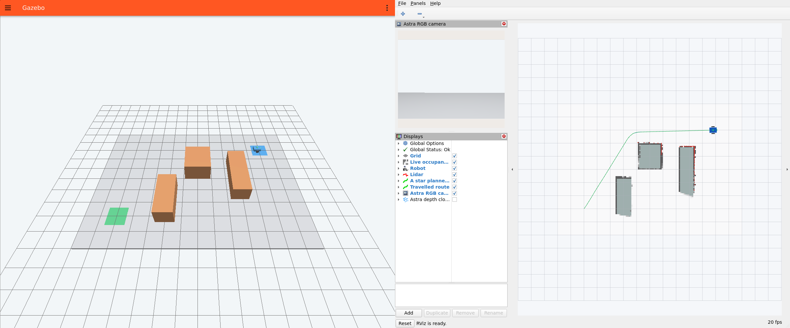

# Автономная GPS-навигация — ROS 2 Humble + Gazebo Fortress

**Язык / Language:** Русский · [English](README.md)

Мобильный робот автономно едет из **A (-5, -3 м)** в **B (5, 3 м)**: обнаруживает препятствия 2D-лидаром, строит карту занятости, планирует безопасный маршрут и останавливается у GPS-точки. Камера RGB-D, имитирующая Orbbec Astra, отдельно проверяет препятствия впереди. Можно выбрать **собственный робот, TurtleBot3 Burger или Jackal** и **полосу препятствий, склад или открытую площадку**.

**Ubuntu 22.04 · ROS 2 Humble · Gazebo Fortress / Ignition Gazebo 6 · Python**

[Соответствие заданию](REQUIREMENTS.ru.md) · [Измеренные результаты](VALIDATION.ru.md) · [Архитектура и алгоритмы](DESIGN.ru.md) · [Ответы по электронике](ELECTRONICS.ru.md) · [Сторонние материалы и лицензии](THIRD_PARTY.ru.md)

[Релиз: исходники, видео и необязательный ROS bag](https://github.com/monijesuj/ros-gazebo-navigation-assignment/releases/tag/v2.0.1). Архив исходников также содержит `evidence/demo.mp4` для просмотра без интернета. Репозиторий закрытый: проверяющему необходимо предоставить доступ либо передать архивы.



## Запуск

Установите ROS 2 Humble по [официальной инструкции для Ubuntu](https://docs.ros.org/en/humble/Installation/Ubuntu-Install-Debians.html) и настройте [репозиторий OSRF для Fortress](https://gazebosim.org/docs/fortress/install_ubuntu/). Затем установите остальные зависимости и запустите проект:

```bash
./scripts/install_dependencies.sh
./run.sh
```

Вторая команда собирает пакет и запускает Gazebo, мосты датчиков, robot state publisher, локализацию, построение карты, навигацию, независимый контроль скорости, независимую проверку результата и RViz. Зелёным отмечена A, синим — B. В RViz видны текущая карта, красные точки лидара, синий запланированный путь, зелёный пройденный путь и изображение RGB-камеры. Робот начинает движение после получения необходимых потоков данных и карты. Ctrl+C завершает запуск.

Выберите любую комбинацию либо воспользуйтесь меню `./choose.sh` в терминале:

```bash
./run.sh robot:=turtlebot3 world:=warehouse
./run.sh robot:=jackal world:=outdoor
./run.sh robot:=custom world:=obstacle_course
```

| Аргумент запуска | Значения / значение по умолчанию |
| --- | --- |
| `robot` | `custom` (по умолчанию), `turtlebot3` (Burger), `jackal` |
| `world` | `obstacle_course` (по умолчанию), `warehouse`, `outdoor` |
| `gui`, `rviz`, `autostart` | `true` (по умолчанию) или `false` |
| `record_bag` | `false` (по умолчанию) или `true` |
| `mission_file` | Необязательный абсолютный путь к изменённому JSON мира/миссии |
| `report_file` | По умолчанию `evidence/mission_report.json` |

Для программного рендеринга или запуска без участия оператора:

```bash
ROBOT_DEMO_SOFTWARE_RENDERING=1 ./run.sh robot:=jackal world:=warehouse
xvfb-run -a env ROBOT_DEMO_SOFTWARE_RENDERING=1 ./run.sh gui:=false rviz:=false
```

GPU-лидару и RGB-D нужен контекст рендеринга даже без окон приложений. Его предоставляет `xvfb-run`; для этого необходимы `xvfb` и `xauth`.

## Воспроизведение в чистом контейнере

Dockerfile устанавливает зависимости в чистый образ ROS Humble / Ubuntu 22.04 и собирает пакет. По умолчанию контейнер выполняет одну реальную миссию Gazebo без окон и возвращает ненулевой код завершения, если независимые проверки не пройдены:

```bash
docker build -t robot-demo .
docker run --name robot-demo-check robot-demo
docker cp robot-demo-check:/demo/evidence ./container-evidence
```

Все девять комбинаций внутри контейнера:

```bash
docker run --name robot-demo-matrix robot-demo xvfb-run -a python3 scripts/verify_matrix.py
```

Локальные интеграционные проверки предполагают, что рабочее пространство уже собрано командой `./run.sh`. Контейнер собирает его автоматически.

Первая сборка требует интернета и может занять несколько минут. Меши включены в репозиторий, поэтому при запуске модели не скачиваются из Fuel. [Шаблон GitHub Actions](ci/github-actions.yml) использует тот же контейнер и сохраняет доказательства проверки. Он поставляется как шаблон, поскольку текущая OAuth-авторизация GitHub не имеет разрешения `workflow`. После предоставления этого разрешения скопируйте файл в `.github/workflows/verify.yml` и отправьте изменения в репозиторий. Удалённый CI не запускался; локальная проверка в чистом контейнере пройдена, её результаты сохранены.

## Навигация и построение карты

1. **Локализация:** `/gps/fix` проецируется в локальную касательную плоскость ENU WGS84. Колёсная одометрия прогнозирует перемещение, нативный IMU симулятора задаёт направление. Компактный фильтр Калмана положения корректирует дрейф по GPS и отбрасывает измерения, отличающиеся от прогноза более чем на 1.5 м. `gps_localizer` — единственный узел, публикующий полное плоское преобразование `map → odom`, включая коррекцию направления при поворотах Jackal с проскальзыванием колёс.
2. **Карта:** сетка с шагом 0.1 м изначально целиком **неизвестна**. Лучи лидара отмечают пройденные клетки свободными, конечные точки — занятыми, используя ограниченные логарифмические отношения шансов. Для скана выбирается ближайшая по времени локализованная поза с учётом смещения лидара выбранного робота. Наблюдения сохраняются; последующие свободные лучи могут очистить ранее занятую клетку. Координаты препятствий, стартовая поза и истинная поза симулятора не передаются узлам локализации, карты и навигации.
3. **Планирование:** A* рассматривает восемь соседей, запрещает срезать углы по диагонали и сокращает путь только по проверенным на столкновения сегментам. Наблюдаемые препятствия и границы карты расширяются на радиус окружности, охватывающей робота, плюс заданный запас. Неизвестные клетки доступны для движения в этой задаче со статическими препятствиями; новые наблюдения вызывают перепланирование. Если новое препятствие помещает робота внутрь предпочтительного запаса, проверенный сегмент выхода сохраняет физический радиус с консервативной поправкой на размер клетки, после чего восстанавливается полный запас.
4. **Управление:** робот поворачивается к вершинам маршрута, движется при ошибке направления менее 0.45 рад и замедляется при приближении. Максимальная скорость собственного робота и Jackal — 0.32 м/с, Burger — 0.22 м/с. Точки миссии посещаются по порядку; конечный допуск — 0.20 м. Завершение, пауза, отсутствие данных датчиков или пути приводят к нулевым запросам скорости.
5. **Безопасность:** отдельный `velocity_guard` — единственный ROS-узел, публикующий `/cmd_vel`. Он проверяет лидар впереди и центральную полосу изображения глубины, ограничивает скорости и останавливает робота при устаревании локализации/GPS/лидара/глубины (2 с) либо команд контроллера (0.5 с). Запас 0.20 м впереди превышает тормозной путь вместе с задержкой наблюдения/контроля 0.15 с при заданных скорости и ускорении. Таймер 20 Гц использует **монотонные часы**, поэтому остановка `/clock` не оставляет ненулевую команду скорости без обновления.
6. **Проверка:** только `mission_monitor` получает истинную позу и контакты Gazebo. Он измеряет фактическую ошибку достижения цели, минимальный геометрический зазор от окружности робота до препятствий, число сообщений контактов и число кадров с касанием препятствий. Текущий отчёт записывается атомарно. Геометрия симулятора доступна только генератору моделей и этому проверяющему узлу.

Реализовано построение карты по датчикам с GPS-локализацией. Сопоставление сканов и полноценный SLAM не используются. Nav2 допускается заданием, но не обязателен; небольшой собственный планировщик позволяет непосредственно проверить алгоритмы и настройки.

## Роботы и миры

| Робот | Привод / источник | Охватывающий радиус | Запас планирования | Ограничение скорости |
| --- | --- | ---: | ---: | ---: |
| Собственный робот (`custom`) | Собственный URDF, два ведущих колеса и два пассивных опорных колеса | 0.39 м | 0.25 м | 0.32 м/с |
| TurtleBot3 Burger | Официальные геометрия и меши ROBOTIS с зафиксированной версией | 0.18 м | 0.24 м | 0.22 м/с |
| Jackal | Официальная геометрия Clearpath с зафиксированной версией, четыре ведущих колеса | 0.36 м | 0.25 м | 0.32 м/с |

Каждый робот оснащён лидаром, RGB-D, GPS по центру в плоскости XY и IMU. У Jackal приводятся передние и задние колёса с каждой стороны; боковое трение уменьшено для поворота с проскальзыванием. Burger сохраняет исходные размеры и колёса. Датчики и нативные плагины Fortress добавлены в рамках проекта; полная аппаратная и программная система производителя не воспроизводится. Версии исходников, оригинальные описания и лицензии находятся в `src/robot_demo/assets/{turtlebot3,jackal}`.

На полосе препятствий робот следует непосредственно к географической точке B. Склад и открытая площадка используют дополнительную географическую точку **(-4.5, 1.5 м)** перед B, отмеченную золотым. Последний участок всё равно требует объезда наблюдаемых препятствий с помощью A*. Контроллер получает координаты точек без заранее заданной карты препятствий. Сценарий использует разрешённый заданием последовательный список waypoints.

Все миры имеют плоскую площадку 14 × 10 м, обозначенные A/B и геодезическое начало **55.75° с. ш., 37.62° в. д., 0 м**. На полосе препятствий — три параллелепипеда, на складе — стеллажи и ящик, на открытой площадке — контейнер, барьер и ящики. Цвета и расположения описаны локальными SDF-моделями; внешняя загрузка не нужна.

## Изменение точек и окружения

Скопируйте выбранный JSON из `src/robot_demo/config/{obstacle_course,warehouse,outdoor}.json`, отредактируйте и передайте абсолютный путь:

```bash
./run.sh robot:=jackal world:=warehouse mission_file:=/absolute/path/my_mission.json
```

Режим `waypoint_mode: "gps"` использует упорядоченные пары `waypoints_gps` `[широта, долгота]`; режим `waypoint_mode: "world"` — пары `waypoints_world` `[восток, север]`. Два списка должны соответствовать друг другу: список мировых координат определяет расположение визуальных маркеров. По умолчанию B — приблизительно **55.75002694515° с. ш., 37.62007962426° в. д.** Начало координат задано геодезической привязкой мира; первая GPS-позиция не становится новым началом.

Файл также определяет `obstacles`, `start`, границы, цвета поверхности/препятствий и разрешение карты. Размеры и ограничения скорости робота берутся из `robots.json`. При запуске создаётся один URDF; это же описание преобразуется командой `ign sdf -p`, снабжается датчиками контактов для всех звеньев с геометрией столкновений и включается в SDF-мир под `.runtime/generated`. Отдельный `mission.json` удаляет геометрию препятствий и стартовую позу симулятора перед передачей узлам управления. Модели можно проверить/экспортировать без запуска ROS:

```bash
python3 scripts/generate_assets.py --robot jackal --world warehouse
```

`multi_waypoint.json` задаёт посещение двух GPS-точек; `world_waypoint.json` демонстрирует режим мировых координат. Отчёты независимых запусков приложены вместе с основной матрицей.

## Топики, TF и сервисы

| Топик | Сообщение ROS / источник | Частота |
| --- | --- | --- |
| `/scan` | `sensor_msgs/LaserScan`, мост лидара | 10 Гц |
| `/camera/{image,depth_image}` | `sensor_msgs/Image`, мост RGB-D | 10 Гц |
| `/camera/{camera_info,points}` | `CameraInfo` / `PointCloud2` | 10 Гц |
| `/gps/fix` | `sensor_msgs/NavSatFix`, мост GPS | 5 Гц |
| `/imu/data` | `sensor_msgs/Imu`, мост IMU | 50 Гц |
| `/odom`, `/joint_states` | `Odometry` / `JointState`, привод | 30 Гц |
| `/localization/pose` | `geometry_msgs/PoseStamped`, локализатор | Частота одометрии |
| `/map` | `nav_msgs/OccupancyGrid`, узел карты; transient local | 2 Гц |
| `/planned_path` | `nav_msgs/Path`, навигатор; transient local | При перепланировании |
| `/travelled_path` | `nav_msgs/Path`, навигатор | 1 Гц |
| `/cmd_vel/nav`, `/cmd_vel` | `geometry_msgs/Twist`, навигатор / контроль скорости | 20 Гц |
| `/mission/{status,verification}` | JSON в `std_msgs/String`, навигатор / монитор | 1 Гц |
| `/safety/status` | JSON в `std_msgs/String`, контроль скорости | 4 Гц |
| `/world/navigation/dynamic_pose/info`, `/contacts/*` | Только входы независимой проверки | Симулятор |

TF: `map → odom` публикует локализатор, `odom → base_link` — привод; фиксированные звенья корпуса/датчиков и подвижные колёса — robot state publisher. Камера использует `camera_optical_link` (Z вперёд), остальные сообщения датчиков — физические системы координат URDF. Локализатор также задаёт номинальную высоту корпуса над плоской поверхностью; остальная локализация остаётся плоской. Пути рисуются на высоте 0.03 м над картой, чтобы избежать конфликтов буфера глубины. В RViz можно включить облако точек камеры глубины Astra. Движение, независимая проверка, лидар, камера, GPS и IMU используют отдельные мосты. ROS-узлы работают по времени симуляции, кроме независимого сторожевого контроля скорости. Подписки датчиков используют sensor-data QoS; карта, план и описание робота — transient-local QoS. Профиль Fast DDS UDP поддерживает разные пространства имён IPC в песочнице/контейнере.

Приостановить/продолжить миссию, сохранить карту и посмотреть состояние можно из терминала с подключённым окружением ROS:

```bash
source /opt/ros/humble/setup.bash
source install/setup.bash
export FASTRTPS_DEFAULT_PROFILES_FILE="$PWD/src/robot_demo/config/fastdds_udp.xml"
ros2 service call /mission/enable std_srvs/srv/SetBool '{data: false}'
ros2 service call /mission/enable std_srvs/srv/SetBool '{data: true}'
ros2 service call /map/save std_srvs/srv/Trigger '{}'
ros2 topic echo /mission/verification
```

`/map/save` сохраняет PGM + YAML в подкаталог каталога отчёта. `./run.sh autostart:=false` запускает миссию на паузе.

## Проверка и запись

```bash
./scripts/check.sh
xvfb-run -a python3 scripts/verify_matrix.py
source /opt/ros/humble/setup.bash
xvfb-run -a python3 scripts/verify_safety.py
./run.sh robot:=jackal world:=warehouse record_bag:=true
```

Матрица проверяет успешное завершение, фактическую ошибку цели < 0.25 м, отсутствие касаний препятствий, потоки истинной позы/контактов, карту по датчикам, все потоки навигационных датчиков, актуальность отчёта и конечную нулевую команду. Для успешных запусков экспортируется карта. Испытания отказов проверяют паузу миссии, остановку часов, завершение процесса контроллера и потерю моста GPS. Чистые Python-тесты охватывают A*, расширение препятствий по габаритам робота, выход из уменьшенного запаса, ENU, очистку лучами, GPS-коррекцию/выбросы и разбор глубины с учётом порядка байтов и шага строк.

Видео релиза записано из реальных окон Gazebo и RViz. Для собственной записи длительностью 1–3 минуты разместите окна рядом на отдельном X11-дисплее 2400 × 1080, запустите миссию на паузе и выполните `scripts/record_demo.py --start-mission`. `demo.json` содержит реальное время захвата и число кадров. Кадры кодируются с частотой 12 кадров/с; из-за затрат на захват воспроизведение может быть быстрее реального времени, что отражено в метаданных. Bag использует временные метки симуляции и включает `/clock`, описание робота, RGB/глубину, TF, карту, команды, безопасность и проверку результата; перед копированием остановите запись. Проверяйте через `ros2 bag info`, воспроизводите отдельно от живой симуляции командой `ros2 bag play <bag-directory>`, используя записанные часы, без второго источника времени воспроизведения.

## Область применения и ограничения

- Fortress соответствует разрешённому в задании варианту Ignition. GPS реализован нативной системой **NavSat + ros_gz_bridge**; указанный **`gazebo_ros_gps` — плагин Classic**, поэтому функциональный эквивалент Fortress явно описан.
- RGB-D — эмуляция Astra (320 × 240, горизонтальный угол обзора 60°, 10 Гц, диапазон 0.15–6 м), а не калиброванная копия конкретного устройства Orbbec. Базовые GPS/IMU — идеальные датчики симулятора; многолучевое распространение GPS, дрейф и шум не включены.
- Локализатор — компактная плоская модель с абсолютной ориентацией IMU симулятора. Реальный IMU не гарантирует глобальное направление без дрейфа. Для больших миров/оборудования нужны подходящее объединение GNSS/IMU, настройка ковариаций и калибровка антенны.
- Движение по неизвестным клеткам предполагает статические препятствия, низкую скорость, текущие наблюдения и контроль датчиков. Прогноз движения динамических препятствий не реализован. Робот, окружённый препятствиями, или физически заблокированная цель приводят к безопасной остановке; полноценное исследование окружения и восстановления SLAM не заявлены.
- Контроль скорости обрабатывает отказ контроллера/датчиков/часов, пока сам работает. На реальном оборудовании нужен сторожевой таймер двигателя и аварийная остановка при отказе контроля скорости/моста/компьютера.
- Запускайте одну симуляцию на ROS domain и `IGN_PARTITION`; в терминалах диагностики задавайте те же значения. Настройки по умолчанию рассчитаны на одну демонстрацию.

## Исходники и ссылки

`robot_demo/assets.py`: генерация URDF/SDF · `localization.py`: GPS/колёса/IMU · `mapping.py`: карта по лучам и экспорт · `planning.py`: A* и ENU · `navigation.py`: контроллер точек · `safety.py`: контроль скорости · `monitor.py`: независимая проверка позы/контактов · `launch/demo.launch.py`: интеграция.

Код проекта распространяется по MIT; материалы ROBOTIS сохраняют Apache 2.0, материалы Clearpath — уведомления BSD. См. [THIRD_PARTY.ru.md](THIRD_PARTY.ru.md). Оригинальные тексты лицензий сохранены без перевода.

- [Документация ROS Humble](https://docs.ros.org/en/humble/)
- [Fortress DiffDrive](https://gazebosim.org/api/gazebo/6/classignition_1_1gazebo_1_1systems_1_1DiffDrive.html) и [NavSat](https://gazebosim.org/api/gazebo/6/classignition_1_1gazebo_1_1systems_1_1NavSat.html)
- [Мост ROS–Gazebo для Humble](https://github.com/gazebosim/ros_gz/tree/humble/ros_gz_bridge)
- [Описание TurtleBot3 от ROBOTIS](https://github.com/ROBOTIS-GIT/turtlebot3/tree/humble/turtlebot3_description)
- [Описание Jackal от Clearpath](https://github.com/jackal/jackal/tree/noetic-devel/jackal_description)
- [Соглашения ROS REP 103](https://www.ros.org/reps/rep-0103.html), [системы координат REP 105](https://www.ros.org/reps/rep-0105.html)
